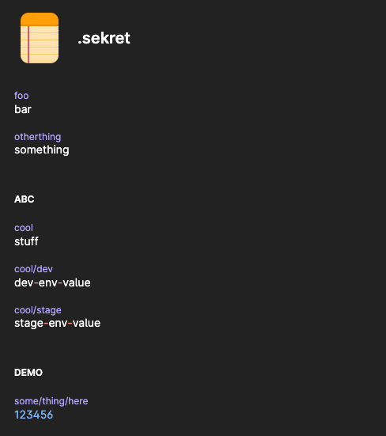

# Sekret

Manage local secrets via 1Password.

:warning: Work in progress.

## How it works

Uses 1Password to store secret values in a Secure Note item. Uses the 1Password CLI to interact with this Secure Note.

The 1Password CLI has a feature where it can trigger the macOS fingerprint prompt when opening a new 1Password session. Sekret makes use of this feature so that you are prompted for a fingerprint whenever reading a secret value (for the first time in that shell's session).

:warning: The 1Password CLI does not support uploading files to the 1Password vault (yet?) so unfortunately Sekret cannot be used for storing credential files, private/public keys, cert files, etc. Only secret values such as passwords and API keys.

:exclamation: The 1Password CLI is really good on its own, check out their [docs](https://developer.1password.com/docs/cli/secret-references). You might not need or want to use Sekret to make use of their great features.

### Sekret vs. 1Password CLI

What Sekret gives you is a thin wrapper around 1Password CLI. Sekret will operate on only one Secure Note item in 1Password and leverage the Secure Note's field structure to store and read values. This keeps your 1Password cleaner than having to make 1 item for each value you want to store for dev projects.

The reason for Sekret's existence is to have a secure way of storing dev secrets such as passwords and API keys and using macOS's fingerprint prompt when reading the values out. Instead of integrating with macOS's fingerprint sensor on my own, I discovered 1Password's excellent CLI where they made accessing it really simple.

I re-wrote Sekret to leverage 1Password as storage instead of local files and so Sekret is just my own preferred abstraction for interacting with my own secret values. If I want another form of storage, such as HashiCorp Vault or something, I can change Sekret's implementation without changing the usage of Sekret in my other scripts.

### How to get started

#### 1. Setup 1Password

1. The 1Password CLI (`op`) must be on your PATH.
2. Biometric unlock must be enabled in the 1Password UI app: `Preferences -> Developer -> Biometric unlock for 1Password CLI`.

See their [biometric unlock docs](https://developer.1password.com/docs/cli/about-biometric-unlock#set-the-biometric-unlock-environment-variable) for more info.

You can set the `OP_BIOMETRIC_UNLOCK_ENABLED` environment variable to `true` if you want to be explicit about it. If not, Sekret will set `OP_BIOMETRIC_UNLOCK_ENABLED=true` when it runs (it won't export it).

#### 2. Setup Sekret

1. Put the `sekret` bash script in this repo in a directory that's included in your PATH.
2. Add `export SEKRET_DIR=your/path/to/sekret/dir` to your .bashrc, .zshrc or similar.
3. Either put the `bin` directory with `jq` in this repo as a sub-directory to wherever you placed the `sekret` script, or set `SEKRET_JQ` to your own version.

See [Configuration options](#configuration-options) for further (optional) setup.

Then start using it by running one of the commands listed below.

See [How to use](#how-to-use) for more info.

### Commands

| Command                       | Description                                                                               |
| ----------------------------- | ----------------------------------------------------------------------------------------- |
| `sekret help`                 | Prints help information.                                                                  |
| `sekret init`                 | Creates the `.sekret` (`SEKRET_1PASS_ITEM`) Secure Note in 1Password if it doesn't exist. |
| `sekret ls` or `list`         | Lists all available secrets.                                                              |
| `sekret add <secret> <value>` | Store the secret with the given name and value.                                           |
| `sekret get <secret>`         | Print the secret value in plain text.                                                     |

#### The `<secret>` key format

- TL;DR: Use the format `{section}.{field}` or `{field}`, where `{field}` does not contain dots (`.`). <secret> cannot containn more than one dot (`.`) which is to delimit section name from field name".
- Use forward slash (/) or underscores (\_) to 'namespace' your fields instead of dots (.)".

More: [1Password format docs](https://developer.1password.com/docs/cli/reference/management-commands/item#item-create-flags).

Example:

Adding some values:

```shell
sekret add foo bar
sekret add otherthing something
sekret add abc.cool stuff
sekret add abc.cool/dev dev-env-value
sekret add avc.cool/stage stage-env-value
sekret add demo.some/thing/here 123456
```

Results in this structure in 1Password. Note how the `ABC` and `DEMO` sections have been created and how `/` is used to further "namespace" secret names:



## Configuration options

Set these environment variables to override defaults.

| Variable               | Description                                                           | Defaults to                                                                    |
| ---------------------- | --------------------------------------------------------------------- | ------------------------------------------------------------------------------ |
| `SEKRET_DIR`           | Path to the directory where the `sekret` script is located            | :exclamation: [Required] You must set this in your .zshrc, .bashrc or similar. |
| `SEKRET_JQ`            | Path to the `jq` executable to use.                                   | `$SEKRET_DIR/bin/jq`                                                           |
| `SEKRET_1PASS_ITEM`    | Name of the Secure Note in 1Password to store secrets in.             | `.sekret`                                                                      |
| `SEKRET_1PASS_VAULT`   | Name of the 1Password Vault to use when doing 1Password operations.   | `Private`                                                                      |
| `SEKRET_1PASS_ACCOUNT` | Name of the 1Password account to use when doing 1Password operations. | `my.1password.com`                                                             |

## How to use

If the `.sekret` Secure Note item does not yet exist in 1Password, run `init` to create it.

```shell
sekret init
```

Add a secret:

```shell
sekret add mysecret myvalue
```

List available secrets:

```shell
sekret ls
```

Read a secret's value in plain text:

```shell
sekret get mysecret
```

Add a secret for a section in the Secure Note:

```shell
sekret add mysection.mysecret myvalue
```

Read a secret in a section:

```shell
sekret get mysection.mysecret
```
